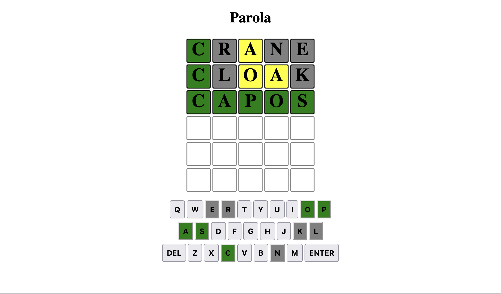

# Parola Game

Parola is a Wordle game clone where you must guess the word within five tries. The word is randomly generated from a list of words. This project was created by following the written guid by Paul Akinyemi [How to Build a Wordle Clone in JavaScript](https://www.freecodecamp.org/news/build-a-wordle-clone-in-javascript/). The purpose of this project was to practice the use of JavaScript and to learn how to use the DOM.

[Play the game!](https://parola-game.netlify.app/)

